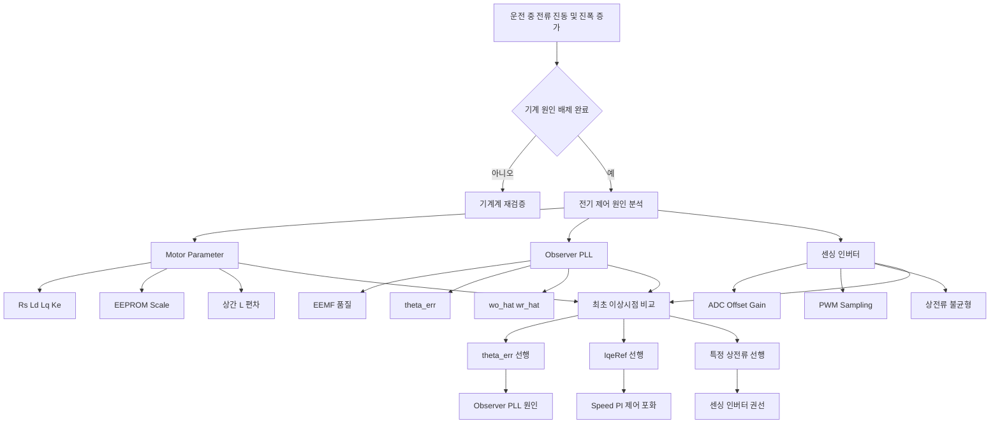
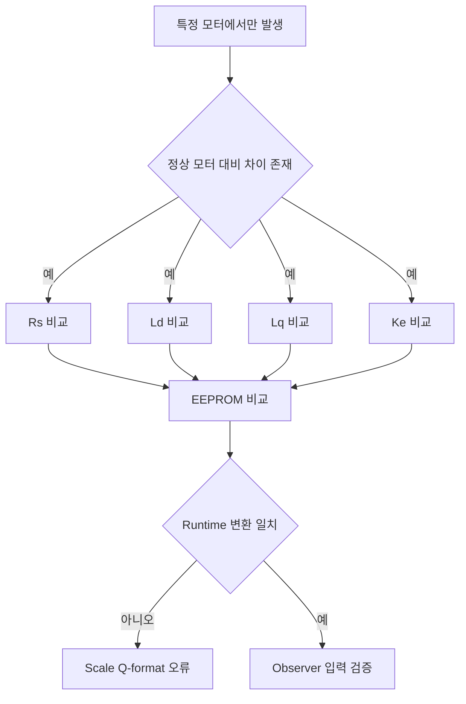
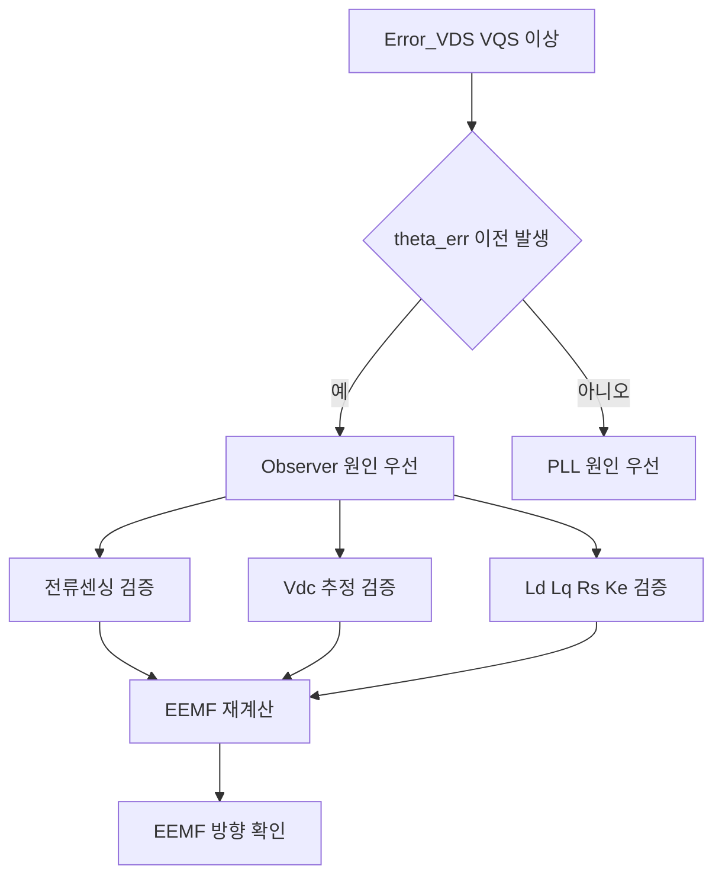
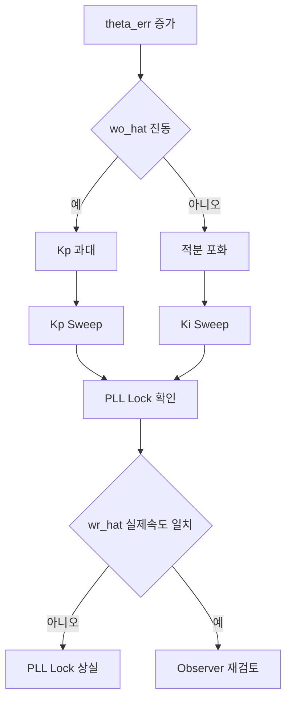
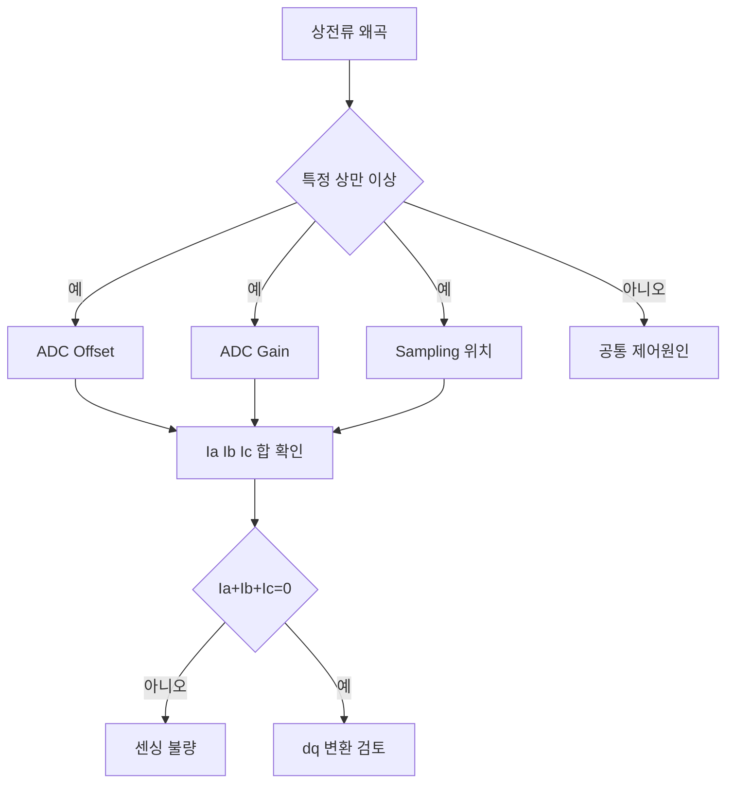
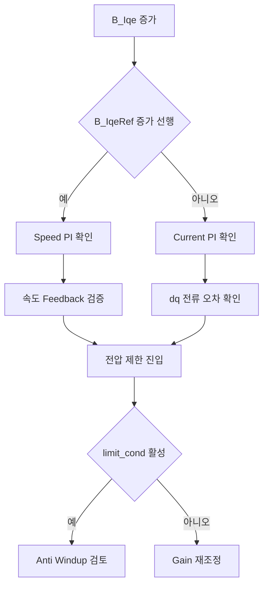
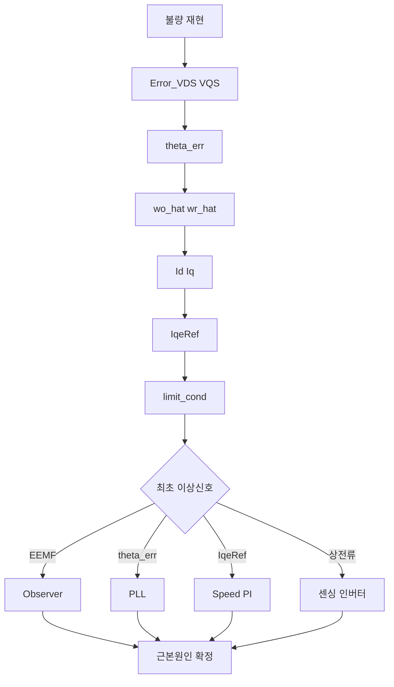

# 센서리스 모터 불량 검토 보고서 (Mermaid Edition)

> 권장 Viewer: VS Code Markdown Preview, Obsidian, GitHub, MkDocs
>
> 본 문서는 ASCII Tree 대신 Mermaid Diagram을 사용하여 Logic Tree가 깨지지 않도록 구성하였다.

---

# 1. 종합 Fault Logic Tree



---

# 2. Motor Parameter Root Cause Tree



---

# 3. Observer Root Cause Tree



---

# 4. PLL Root Cause Tree



---

# 5. Current Sensor Root Cause Tree



---

# 6. Current PI Root Cause Tree



---

# 7. 최종 원인 판정 Flow



---

# 8. 추천 측정 변수

## Mode A : Observer

```text
Error_VDS_hat_sl
Error_VQS_hat_sl
IDS_mori
IQS_mori
```

## Mode B : PLL

```text
theta_err_mori
wo_hat_mori
wr_hat_mori
Error_sum_mori
```

## Mode C : Current Loop

```text
B_IdeRef
B_Ide
B_IqeRef
B_Iqe
```

## Mode D : Fault

```text
limit_cond
fdetect_pos_err
IF_Trans_fail
taljo_restart_cnt
```

---

# 핵심 결론

```text
기계원인 배제 상태

1순위
Motor Parameter 불일치
Rs Ld Lq Ke

2순위
Observer EEMF 계산 오류

3순위
PLL Lock 상실

4순위
센싱 Offset Gain Sampling

5순위
Current PI 및 Limit
```

최초 증가한 Error를 찾는 것이 핵심이다.
